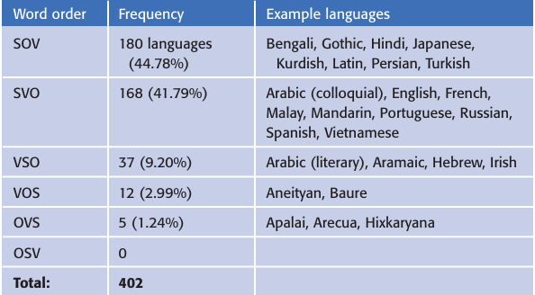
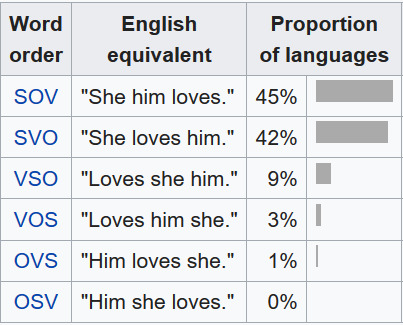

## Chapter Summary: The Development and Classification of Languages

### The current state of the English language
This section of The Development of English takes readers on a journey through the life of the English language—from its ancient roots to its global presence today. Rather than simply listing facts, the chapter explores how languages grow and transform, much like living organisms shaped by time, contact, and culture. English, once a local tongue spoken only in early medieval England, has evolved into a global language spoken by billions, shaped by migration, conquest, innovation, and everyday use.

The chapter introduces two important ways of looking at language: _synchronic_ (how a language works now) and _diachronic_ (how it has changed over time). English is seen not as a fixed system but as something constantly in motion, influenced both from within (like simplification of grammar) and from outside (like colonization or the blending with other languages through contact). These shifts have led to the rich and varied English we know today—ranging from regional dialects to global Englishes spoken in places far from its original homeland.

### Genetic classifications of languages
The text also explains how languages are grouped into families, tracing English back through the Germanic branch to the larger Indo-European family. Using tools like the comparative method, scholars piece together ancient connections through shared vocabulary and grammar. The chapter brings this to life with examples—such as how the word “foot” links English to its linguistic cousins, even when the sounds and spellings differ.

Finally, it reflects on the bigger picture: how language mirrors human history and identity. Whether shaped by invasion, printing presses, or everyday conversation, English tells a story not just of words, but of people—of who we were, who we are, and how we communicate across time and space.

The chapter describes that in 19th Century philologist **Jacob Grimm** established a sound change know as the **Grimm’s Law**. This helped distinguish Germanic branch of language from other Indo-European Languages. It denotes for example the shift from Indo-European **/p/** to Germanic **/f/**, this is one of the features that can show distinction between language families and show that English is a Germanic language. 

However the author of the book points out that comparing cognate vocabulary is not the only way to prove that languages should be classified into families of similar ones. Big part of comparing languages is also their **grammar** and the similarities in grammar structure of various languages. The chapter notes that most Indo-European languages contain **inflection** which marks **case**, **number** and **gender** on nouns, adjectives and sometimes articles. The author of the chapter goes on to explain how these markers were present in PIE language. Further in the chapter the author presents a table with comparison of Latin and English showcasing that some PIE languages have a more complex morphology than others. The author explains the morphology of Latin as compared to English it is a highly inflectional language, showing how the Latin equivalent of the English word „girl” is inflected using cases (Nominative, Genitive, Dative, Accusative, Ablative, Vocative) and number (singular or plural). Latin here is contrasted with English and German, proving that adjectives in Latin are also inflected. The author explains that English has a rather simplified system for marking case, number and gender mostly highlighting them with the use of determinatives such as this/these. 

Another way to compare languages marked by the author is looking at **historical/archeological information**. It is definitely less linguistic than the previous two ways, but can be a useful comparison tool as well.  This way of looking at languages however has its limitations, since the further in the past we look the less reliable the linguistic and historical information become. As the most widely accepted theory of how the PIE language came to be, the author denotes the **Kurgan Hypothesis**. This theory states that PIE language originated north of the Black Sea and spread through migrations by horse-riding warriors. The author also points out how the comparative  method has helped reconstruct language families like Indo-European. The chapter mentions some theories that go beyond PIE proposing larger language families such as Eurasiatic, Nostratic and Proto-World, however these theories are highly controversial. 

The next section of the Chapter titled **„The Development of English”** shows the history of English language. Starting from talking about its beginnings around AD 400, after the Romans left England. In the sub-section about Old English the author highlights that at this stage the language was highly inflectional with case, number, and gender markings showing this at an example of the Old English version of “The Lord’s Prayer.” The next sub-section talks about Middle English illustrating the changes which occurred in the language and showing Middle English vocabulary and grammar with the example of Chaucer’s Canterbury Tales. 

The next section explores the codification and standardization of English during the **Modern English period**, highlighting: 
* the publication of major grammar and dictionaries like Samuel Johnson’s 1755 dictionary or Noah Webster’s 1806 dictionary,
* attempts to create an “English Academy” similar to the French Academy were unsuccessful, but these efforts signified a growing concern for documenting and prescribing the language,
* the transition from Middle to Modern English, explaining how vowels were raised in the vowel chart or became diphthongs, and visualizing the process of analyzing vowels to put them in the **vowel chart**. 
The chapter then examines the impact of colonization, focusing on how the colonization of America and the rise of the United States as a superpower spread English globally, leading to the emergence of many new varieties of English.

### Typological classifications of languages
Next, the text discusses **typological language classification**, which groups languages by shared linguistic structures, such as word order, rather than by historical relationships. English is categorized as an SVO language. 

The author distinguishes between **internal** and **external** influences on language change. According to the author, natural processes, such as simplifications, have led English to evolve from a highly inflected language to a more isolating one. And externally, contact with other languages, especially French, after the Norman Conquest, introduced significant vocabulary and structural changes.

The picture below lists the six possible word orders that can potentially occur in human language, and the frequency with which they occurred in 402 languages that Tomlin (1986) studied.

Furthermore, there is a discussion of **language change as a dynamic process**, noting how internal pressures such as regularization and external pressures like social or cultural contact work together to drive changes in English. Examples include the Great Vowel Shift and shifts in word order due to declining case marking.

### Language Universals and Typology: Generative vs. Cross-Linguistic Approach

The study of **language typology** is strongly linked to the investigation of _language universals_. Generative linguists usually analyze a limited set of languages to reveal profound, abstract structures, influenced by **Chomsky’s principles** and parameters theory which suggests all human languages have universal principles yet varying parameters; in contrast, typologists such as Greenberg adopt a wider,
cross-linguistic perspective. They analyze extensive collections of languages to uncover patterns and trends, referred to as statistical universals. Greenberg's research recognized most important word orders such as SOV and SVO as dominant all over the world.

### Why Languages Change

Additionally, the author explores the topic of **language change** and if it can be understood as synonymous with evolution. Certain linguists say that "evolution" is simply a **metaphor for change**, whereas others like Croft employ models influenced by biological theories, indicating that language evolves through mechanisms like _replication, variation, and selection_. For example, the reduction in the
use of "whom" instead of "who" demonstrates how variations can become the new standards and ultimately replace older versions.

Language alteration happens due to **internal** and **external factors**: internally, a language might simplify its morphology or change its phonology (such as vowel shifts); externally, it can incorporate features from other languages through exchanging interactions, which is often seen in the significant borrowing of Latin terms into English. In more severe cases, such interactions can result in the extinction of languages, especially **indigenous languages**. The spread of English has made these impacts stronger, eliciting worries about whether it serves as a global lingua franca or acts as a _"killer language."_

In the end, the author points out that changing language is **inherent and inevitable**. What could be considered errors—for example saying "flaunt" instead of "flout," or using singular "they"—might represent present, extensive changes in language usage and structure, stressing the fluid and felxible character of communication.